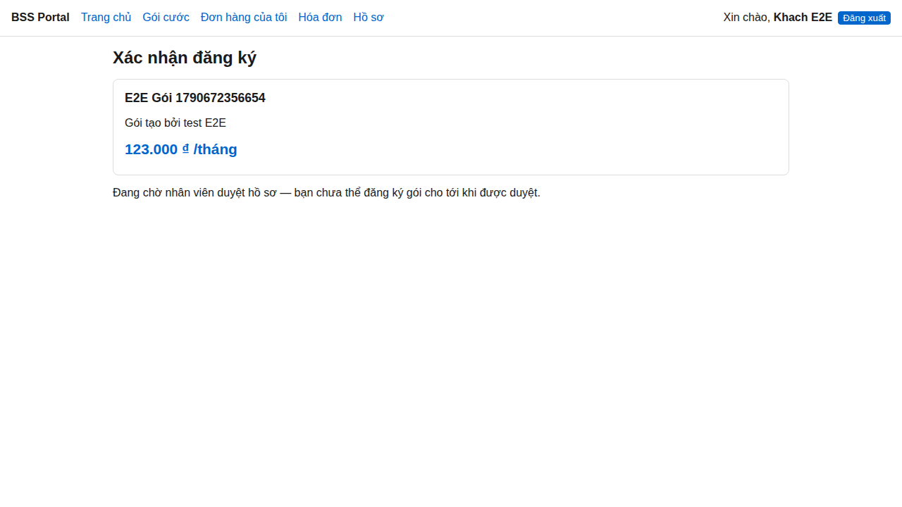
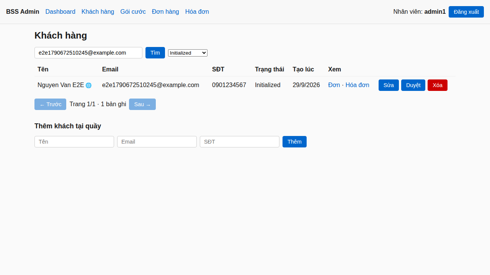
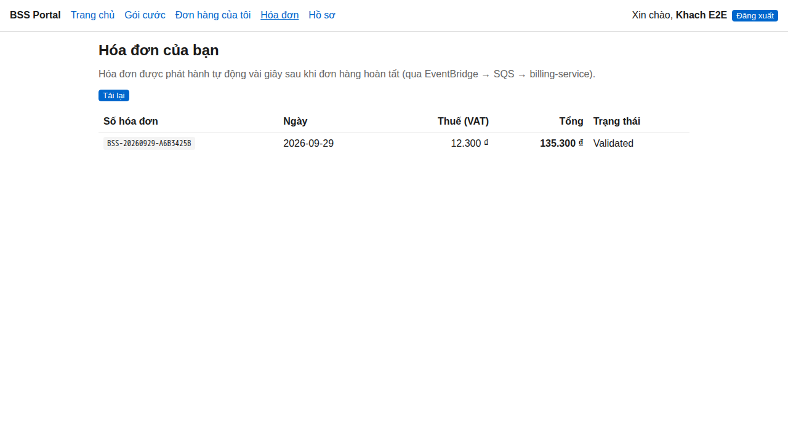
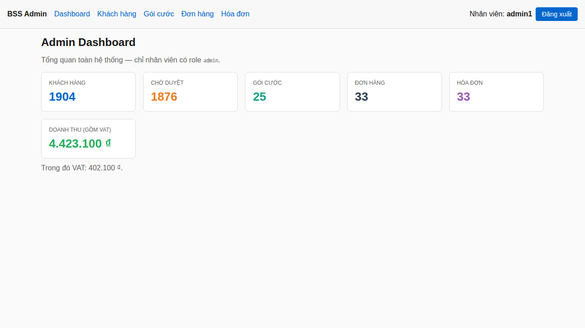
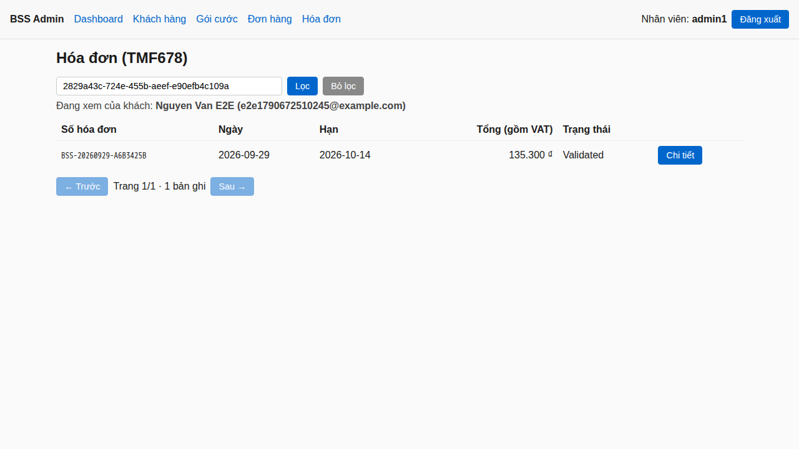

# BSS Platform on AWS EKS

> Production-grade reference implementation of a **Business Support System (BSS)** running on **Amazon EKS** — full monorepo with frontend, backend microservices, Infrastructure-as-Code, GitHub Actions CI/CD, and an observability stack.

[](https://github.com/NguyenDucManhDOE247/BSS-Platform/actions/workflows/ci-backend.yml)
[](https://github.com/NguyenDucManhDOE247/BSS-Platform/actions/workflows/ci-frontend.yml)
[](https://github.com/NguyenDucManhDOE247/BSS-Platform/actions/workflows/ci-terraform.yml)
[](https://github.com/NguyenDucManhDOE247/BSS-Platform/actions/workflows/ci-k8s.yml)
[](https://openjdk.org/projects/jdk/21/)
[](https://spring.io/projects/spring-boot)
[](https://www.terraform.io/)
[](https://kubernetes.io/)
[](https://aws.amazon.com/eks/)
[](LICENSE)
[](docs/ROADMAP.md)
[](CONTRIBUTING.md)

## Table of contents

- [What's here](#whats-here)
- [Architecture](#architecture)
- [Microservices (TM Forum-aligned)](#microservices-tm-forum-aligned)
- [Tech stack](#tech-stack)
- [Quick start](#quick-start)
- [Project status](#project-status)
- [Scope and known limits](#scope-and-known-limits)
- [Cost](#cost)
- [Learning roadmap](#learning-roadmap)
- [Repo conventions](#repo-conventions)
- [Contributing & security](#contributing--security)
- [License](#license)

## What's here

A complete monorepo: **2 websites + 5 backends + Keycloak + shared libs + 4-state infrastructure + CI/CD**.

```
bss-platform/
├── apps/
│   ├── frontend/       web-portal, admin-console        (Vite + React, OIDC/PKCE login)
│   ├── backend/        api-gateway + 4 services         (Spring Boot 3.5, Java 21, JWT resource servers)
│   └── identity/       keycloak                         (optimized image for AWS — ADR-011)
├── packages/           bss-common-java (GitHub Packages), api-contracts (OpenAPI 3.1)
├── infrastructure/
│   ├── terraform/      9 modules + environments/{shared,dev,staging,prod}
│   └── kubernetes/     base/ + components/ (keycloak) + overlays/{local,dev,staging,prod}
├── platform/           addon values (ALB Controller, ExternalDNS, Secrets CSI, Karpenter, Prometheus, Fluent Bit, OTel)
├── deploy/             docker-compose: Postgres, Redis, LocalStack, Keycloak
├── .github/workflows/  10 CI/CD pipelines (path-filter + tag-based promotion)
├── scripts/            e2e (local / API flow / browser), release-manifest (CD), smoke, chaos, bootstrap, teardown, …
├── tools/ops/          Python ops tools (orphan finder, cost report, DLQ, health check)
├── tests/              k6 load tests + Playwright browser E2E
└── docs/               14 ADRs, 17 runbooks, 6 labs with measured results, SETUP, SLO, postmortems
```

## Architecture

```
   Browser (customers → web-portal, staff → admin-console)
      │ HTTPS — TLS 1.3, ACM certificate, bssplatform.dpdns.org (ADR-012)
      ▼
  Route 53 (ExternalDNS) → AWS WAF → ALB        /  /admin  /api  /auth/realms  /auth/resources
      │
      ▼
  ┌──────────────────────── EKS Cluster ────────────────────────┐
  │                                                              │
  │  Frontend pods       Backend pods            Platform        │
  │  ─────────────       ────────────            ────────        │
  │  web-portal          api-gateway             Prometheus      │
  │  admin-console       Keycloak (2 on prod)    Grafana         │
  │                      customer-service        Alertmanager    │
  │                      product-catalog         Fluent Bit      │
  │                      order-management ──┐    OTel Collector  │
  │                      billing-service  <─┤    Karpenter (dev) │
  │                                         │    ExternalDNS     │
  └─────────────────────────────────────────┼────────────────────┘
                                            │
       ┌────────────────────────────────────┼────────────────┐
       ▼                                    ▼                ▼
  RDS PostgreSQL 16                EventBridge → SQS    Secrets Manager
  (one DB + one user per service)  (+ DLQ)              + X-Ray + CloudWatch
```

No CloudFront and no interface VPC endpoints: the cluster reaches AWS through a NAT Gateway (one per AZ on prod —
[ADR-002](docs/adr/ADR-002-mang-dev.md), [ADR-013](docs/adr/ADR-013-runner-cd-trong-vpc.md)). Keycloak's admin API
(`/auth/admin`) is never routed through the ALB.

## Microservices (TM Forum-aligned)

| Service | Responsibility | TMF API |
|---|---|---|
| `customer-service` | Customer lifecycle; profile bound to the Keycloak `sub`; staff approve / suspend | TMF629 |
| `product-catalog`  | Plans, offers, pricing (the server decides the price) | TMF620 |
| `order-management` | Order capture, transactional outbox → EventBridge, `Idempotency-Key` | TMF622 |
| `billing-service`  | Invoicing (VAT 10%) from an idempotent SQS consumer — payments are out of scope | TMF678 |
| `api-gateway`      | Routing, coarse auth (401/403) | — |
| Keycloak           | Identity: self-registration, OIDC/PKCE, roles `customer`/`admin` | — |

## Tech stack

| Layer | Tech |
|---|---|
| Cloud | AWS (EKS, RDS, ECR, EventBridge, SQS, ALB, WAF, Route 53, ACM, Secrets Manager, CloudWatch, X-Ray) |
| Backend | Java 21, Spring Boot 3.5, Spring Cloud Gateway, Spring Security (JWT), Resilience4j, AWS SDK v2 |
| Identity | Keycloak 26.8 (OIDC + PKCE), per-customer data ownership by `sub` ([ADR-008](docs/adr/ADR-008-danh-tinh-va-quyen-so-huu.md)) |
| Frontend | Vite, React 18, TypeScript, react-query |
| Container | Multi-stage Docker, non-root, read-only root filesystem, Trivy gate in CI |
| Orchestration | EKS 1.34 + Managed Node Groups; Karpenter (Spot) on dev ([ADR-010](docs/adr/ADR-010-karpenter-lam-that-o-dev.md)) |
| Edge | ALB (AWS Load Balancer Controller) + WAF; HTTPS with Route 53 + ACM + ExternalDNS ([ADR-012](docs/adr/ADR-012-https-ten-mien.md)) |
| IaC | Terraform ≥ 1.10 (S3 native state locking) + hashicorp/aws |
| K8s packaging | Kustomize (base + components + overlays/{local,dev,staging,prod}) |
| CI/CD | GitHub Actions + OIDC → IAM Role (no static keys); version source of truth in git + `deploy-state` branch ([ADR-005](docs/adr/ADR-005-nguon-su-that-phien-ban-cd.md)) |
| Observability | kube-prometheus-stack (in-cluster) + Fluent Bit → CloudWatch + OTel → X-Ray |
| Secrets | AWS Secrets Manager + Secrets Store CSI Driver |

## Quick start

Full, verified walkthrough: **[docs/SETUP.md](docs/SETUP.md)** (tools → local → kind → AWS → teardown, each step
with a check). The short version:

```bash
./scripts/e2e-local.sh --stay-up          # docker-compose + 5 backends + Keycloak, full business flow, then keep running
cd apps/frontend/web-portal && npm ci && npm run dev    # http://localhost:3000

# Kubernetes on your laptop ($0) — see infrastructure/kubernetes/overlays/local/README.md
./scripts/kind-up.sh && ./scripts/auth-install.sh kind && make build-images   # then kind load + kubectl apply -k …/overlays/local
./scripts/e2e-flow.sh kind && ./scripts/e2e-browser.sh    # API flow (customer + staff) and Playwright on http://bss.localhost

# AWS (costs money — read every plan)
./scripts/bootstrap-aws.sh                                # once per account
make ENV=shared tf-init tf-plan tf-apply                  # ECR, GitHub OIDC, deployer roles, Route 53 zone + ACM cert — once
make ENV=dev tf-init tf-plan tf-apply                     # ~20 min
./scripts/platform-install.sh dev                         # then db-bootstrap, then run "CD — dev" in GitHub Actions
./scripts/smoke.sh dev && ./scripts/e2e-flow.sh dev       # through https://dev.bssplatform.dpdns.org
make ENV=dev tf-destroy                                   # every evening

git tag rc-v2.4.0 <sha> && git push origin rc-v2.4.0      # → staging
git tag v2.4.0 <sha>    && git push origin v2.4.0         # → prod (same commit as the rc, manual approval)
```

## Project status

Latest release: **`v2.3.0`** (2026-10-06), promoted `rc-v2.3.0` → staging → `v2.3.0` → prod. Phase-by-phase tracking
lives in [docs/ROADMAP.md](docs/ROADMAP.md). Today:

| Phase | Status |
|---|---|
| 0 — Scaffold (monorepo, Terraform modules, CI/CD, docker-compose) | ✅ Done |
| 1 — Local dev end-to-end (5 backends, 2 frontends, real browser run) | ✅ Done |
| 2 — Kubernetes local (`kind`) + observability local | ✅ Done |
| 3 — CI green on GitHub (tests actually executing) | ✅ Done |
| 4 — Terraform + real AWS bootstrap (`apply`/`destroy`, no orphans) | ✅ Done |
| 5 — Deploy dev to real EKS (RDS, EventBridge/SQS, ALB) | ✅ Done |
| 6 — CD: dev auto-deploy → staging/prod tag-based promotion + rollback | ✅ Done |
| 7 — Observability + security on AWS (dashboards, OAuth2, WAF, Trivy gate) | ✅ Done |
| 8 — Reliability, load test, ops tooling, docs, `v1.0.0` | ✅ Done |
| 9 — Real product: Keycloak identity (PKCE), self-registration → admin approval, per-customer data ownership, `v2.0.0` on prod | ✅ Done |
| Debt pass 8 → 0 — Karpenter (Spot) on dev, NetworkPolicy enforced on EKS, Spring Boot 3.5 (0 HIGH/CRITICAL CVE), orphan finder | ✅ Done |
| Hardening after Phase 9 — production-grade Keycloak (2 replicas, read-only rootfs), auth always on, Definition of Done reviewed from a clean clone ([ROADMAP](docs/ROADMAP.md#definition-of-done-for-v100)) | ✅ Done |
| HTTPS + custom domain — `bssplatform.dpdns.org`, TLS 1.3, browser sign-in on AWS, `v2.2.0` ([ADR-012](docs/adr/ADR-012-https-ten-mien.md)) | ✅ Done |
| Both websites verified on every environment — one API-flow script + Playwright on kind, dev, staging and prod | ✅ Done |
| Losing an Availability Zone on prod — measured three times, three real defects fixed, `v2.3.0` ([Lab 10](docs/labs/10-az-outage.md)) | ✅ Done — remaining risks listed below |

Every ✅ above was verified against **real infrastructure**, not just written and assumed working —
see [`docs/adr/`](docs/adr/) for the decisions, [`docs/runbooks/`](docs/runbooks/) and [`docs/labs/`](docs/labs/)
for the verification evidence. See [CHANGELOG.md](CHANGELOG.md) for the release history.

### The two websites

A customer registers on **web-portal**, waits for approval, buys a plan, and sees only their own
invoices; staff approve customers and manage plans, orders and invoices on **admin-console**. Both sites read the
same backends and databases: an approval shows up for the customer immediately, an invoice a few seconds after the
order (outbox → EventBridge → SQS). Screenshots are from the Playwright browser test (`scripts/e2e-browser.sh`) on
`kind` — test data only.

| web-portal (customer) | admin-console (staff) |
|---|---|
|  |  |
|  |  |
| |  |

> Browser sign-up and sign-in work on `kind` (`http://bss.localhost`) and on AWS over HTTPS
> (`https://dev.bssplatform.dpdns.org`, `staging.…`, and the apex for prod). After every deploy,
> `scripts/e2e-flow.sh <kind|dev|staging|prod>` and `scripts/e2e-browser.sh <env>` exercise both sites.
> Staff accounts on AWS are issued by the operator with `scripts/admin-user.sh` — the AWS realm ships no users.

## Scope and known limits

Deliberately out of scope: **payments** (an invoice stays `Validated`), the **OSS** side (an order completes
immediately), and a cache (Redis exists only in docker-compose). No environment runs permanently — see [Cost](#cost).

Known and not fixed, each with the measurement behind it:

- The EKS public endpoint is open (`0.0.0.0/0`) for the few hours a staging/prod demo lives, because GitHub-hosted
  runners have no fixed IP. An in-VPC CodeBuild runner was built and withdrawn: this AWS account's CodeBuild quota
  is 0 ([ADR-013](docs/adr/ADR-013-runner-cd-trong-vpc.md)).
- After losing an AZ ([Lab 10 §4](docs/labs/10-az-outage.md)): a CoreDNS pod in the dead AZ slows every pod for
  about 50 s (inferred, not yet isolated), prod has no spare CPU when a node is lost (8 vCPU account quota), and
  pods do not rebalance when the AZ returns.
- The ACM certificate expires on 2027-04-17 and only renews automatically while attached to an ALB
  ([runbook](docs/runbooks/https-domain.md) §4).

## Cost

Measured, not estimated (per-environment sizing in [PROJECT.md §4](PROJECT.md)):

| Environment | Pattern | Approx. cost while up |
|---|---|---|
| Dev | `terraform apply` for a session, `destroy` the same evening | ~$0.3–0.4/hour |
| Staging | Ephemeral — stood up for a release, destroyed after ([ADR-006](docs/adr/ADR-006-staging-prod-ephemeral.md)) | ~$0.4/hour |
| Prod | Ephemeral — 4 × t3.large, multi-AZ RDS, one NAT per AZ | ~$1.3/hour |

> No environment in this project runs 24/7. With everything destroyed the account costs the Route 53 zone
> ($0.50/month) plus ECR storage; a monthly AWS Budget alert is set at $30. The default 8-vCPU On-Demand quota
> means only one large cluster can exist at a time.

## Learning roadmap

Ten phases (0–9) from a scaffold that had never run to a product verified on real infrastructure, then a debt pass
and hardening. See [docs/ROADMAP.md](docs/ROADMAP.md).

## Repo conventions

The full set of architectural decisions, coding conventions, security rules, and Phase-by-phase plan lives in [PROJECT.md](PROJECT.md).

## Contributing & security

- [CONTRIBUTING.md](CONTRIBUTING.md) — dev environment, commit convention, code style, PR checklist.
- [SECURITY.md](SECURITY.md) — how to report a vulnerability (please **don't** open public issues for security bugs).
- [CHANGELOG.md](CHANGELOG.md) — Keep-a-Changelog history.

## License

MIT — see [LICENSE](LICENSE).
