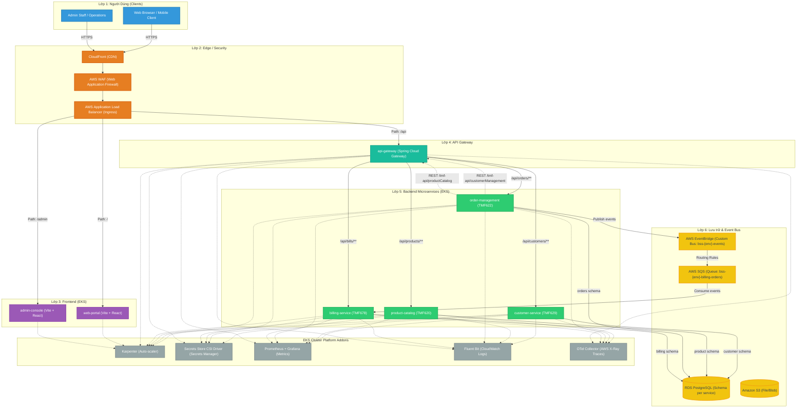
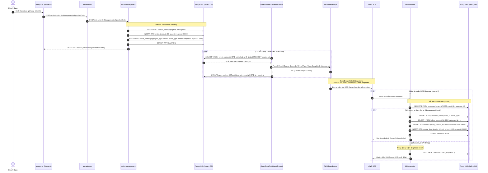
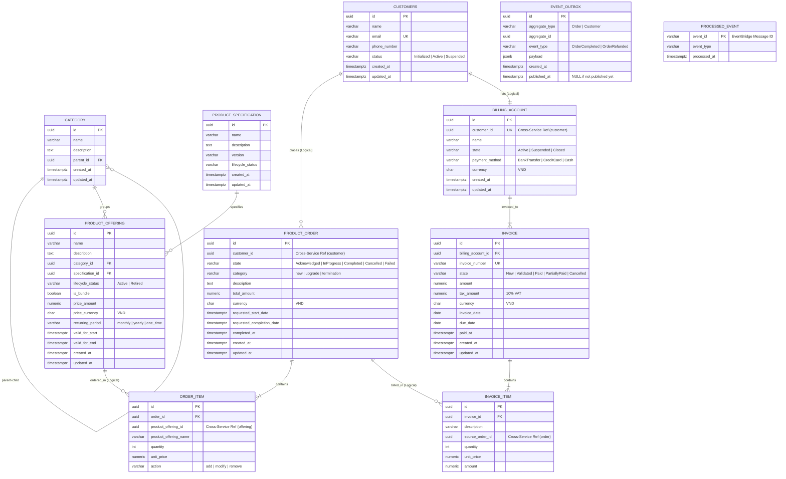

# BSS Platform System Architecture

Tài liệu này mô tả chi tiết kiến trúc hệ thống **Business Support System (BSS) Platform** được triển khai dưới dạng Monorepo trong repo này. Hệ thống được thiết kế theo chuẩn viễn thông của **TM Forum Open APIs**, hoạt động trên hạ tầng **AWS EKS**, quản lý bằng **Terraform IaC** và có cơ chế **CI/CD** tự động hóa hoàn toàn.

---

## 1. Tổng Quan Kiến Trúc 5 Lớp (5-Layer Architecture)

Hệ thống được cấu trúc thành 5 lớp logic độc lập cùng với một lớp nền tảng (Platform) quản lý các tiện ích bổ trợ của EKS cluster:

---

## 2. Luồng Nghiệp Vụ Hướng Sự Kiện (Event-Driven & Outbox Pattern)

Để đảm bảo tính nhất quán dữ liệu cuối cùng (**Eventual Consistency**) giữa các microservices độc lập mà không gây thắt nút cổ chai (bottleneck) hoặc lỗi liên hoàn (cascade failures), hệ thống áp dụng pattern **Transactional Outbox** cùng với **EventBridge** và **SQS**.

### Sơ đồ luồng Order Completed & Billing:

---

## 3. Mô Hình Thực Thể Dữ Liệu Chi Tiết (Database Schemas)

Hệ thống tuân thủ nguyên tắc **Database-per-Service**. Mỗi microservice sở hữu một database riêng biệt trong RDS PostgreSQL instance (phân tách schema cứng), không một service nào được phép truy cập trực tiếp vào DB của service khác. Dữ liệu liên thông hoàn toàn qua API RESTful sync hoặc Async Event Bus.

---

## 4. Kiến Trúc Hạ Tầng Trên AWS EKS (Deployment Topology)

Mô hình kiến trúc hạ tầng chạy trên AWS, được quản lý toàn diện thông qua mã nguồn **Terraform** trong thư mục `infrastructure/terraform`:

```mermaid
graph TD
    subgraph AWS["AWS Cloud (ap-southeast-1)"]
        subgraph VPC["VPC: bss-dev-vpc (10.0.0.0/16)"]
            
            subgraph Public["Public Subnets (Mỗi AZ 1 Subnet - Ingress Facing)"]
                Route53["Route 53 DNS"]
                ALB_AWS["AWS Application Load Balancer"]
            end

            subgraph Private_App["Private App Subnets (Mỗi AZ 1 Subnet - EKS Nodes)"]
                subgraph EKS["EKS Cluster (bss-dev-eks)"]
                    
                    subgraph K8s_System["kube-system Namespace"]
                        ALB_Ctrl["ALB Ingress Controller"]
                        ExtDNS["ExternalDNS"]
                        CSI["Secrets Store CSI Driver"]
                    end
                    
                    subgraph Karpenter_NS["karpenter Namespace"]
                        Kar["Karpenter Controller"]
                    end

                    subgraph BSS_NS["bss Namespace (Workloads)"]
                        subgraph FPods["Frontend Pods (Vite+React+Nginx)"]
                            WP_Pod["web-portal-pod"]
                            AC_Pod["admin-console-pod"]
                        end
                        
                        subgraph GWPods["Gateway Pods (Spring Cloud Gateway)"]
                            GW_Pod["api-gateway-pod"]
                        end
                        
                        subgraph BPods["Backend Pods (Spring Boot 3, Java 21)"]
                            CS_Pod["customer-service-pod"]
                            PC_Pod["product-catalog-pod"]
                            OM_Pod["order-management-pod"]
                            BS_Pod["billing-service-pod"]
                        end
                    end
                    
                    subgraph Obs_NS["observability / monitoring Namespaces"]
                        Prom_Stack["kube-prometheus-stack (Grafana + Prom)"]
                        Fluent_Pod["Fluent Bit Agent"]
                        OTel_Coll["OpenTelemetry Collector"]
                    end
                end
            end

            subgraph Private_DB["Private DB Subnets (Database Layer)"]
                RDS[("RDS PostgreSQL (Multi-AZ)")]
            end
            
            subgraph VPCE["VPC Endpoints (Tiết kiệm NAT Gateway)"]
                VPCE_S3["S3 Gateway Endpoint"]
                VPCE_SM["Secrets Manager Endpoint"]
                VPCE_ECR["ECR Registry Endpoints"]
                VPCE_CW["CloudWatch Endpoint"]
                VPCE_XR["X-Ray Endpoint"]
            end
        end

        subgraph Managed_Services["AWS Managed Services"]
            AWS_SM["AWS Secrets Manager"]
            AWS_ECR["Amazon ECR (Docker Images)"]
            AWS_EB["Amazon EventBridge (Custom Bus)"]
            AWS_SQS["Amazon SQS (Queues + DLQ)"]
            AWS_CW["Amazon CloudWatch Logs"]
            AWS_XR["AWS X-Ray"]
            AWS_S3["Amazon S3 (File Storage)"]
        end
    end

    %% Network Routing Paths
    Route53 -->|Cname / A Record| ALB_AWS
    ALB_AWS -->|Route path: / | WP_Pod
    ALB_AWS -->|Route path: /admin | AC_Pod
    ALB_AWS -->|Route path: /api | GW_Pod
    
    GW_Pod -->|Intra-cluster Service DNS| CS_Pod
    GW_Pod -->|Intra-cluster Service DNS| PC_Pod
    GW_Pod -->|Intra-cluster Service DNS| OM_Pod
    GW_Pod -->|Intra-cluster Service DNS| BS_Pod

    %% DB Connections
    BPods -->|TCP 5432 / IAM Auth / SSL| RDS

    %% EKS Controllers Operations
    ALB_Ctrl -->|Reconcile Ingress| ALB_AWS
    ExtDNS -->|Manage DNS Records| Route53
    Kar -->|Provision Nodes| AWS
    
    %% AWS integrations via VPC Endpoints
    CSI -->|Mount secrets| VPCE_SM --> AWS_SM
    BPods -->|Push images| VPCE_ECR --> AWS_ECR
    OM_Pod -->|PutEvents| AWS_EB
    AWS_EB --> AWS_SQS
    AWS_SQS -->|SQS Consumer| BS_Pod
    
    %% Observability Export
    Fluent_Pod -->|Send Logs| VPCE_CW --> AWS_CW
    OTel_Coll -->|Send Traces| VPCE_XR --> AWS_XR
    BPods -->|Trace Instrumentation| OTel_Coll
    BPods -.->|Actuator Metrics Scrape| Prom_Stack
    
    %% S3 integration
    BPods -->|S3 API| VPCE_S3 --> AWS_S3
```

---

## 5. Các Quyết Định Kiến Trúc Trọng Tâm (Key Architecture Design Decisions)

### 5.1 Database-per-Service Pattern
- **Quyết định:** Mỗi service sở hữu một DB schema độc lập, truy cập thông qua tài khoản DB riêng biệt với quyền truy cập giới hạn duy nhất trong schema đó.
- **Trade-off:**
  - *Ưu điểm:* Cách ly lỗi dữ liệu hoàn toàn. Cho phép mở rộng quy mô (scale) DB độc lập. Dễ dàng chuyển sang các loại database khác (ví dụ: MongoDB cho catalog, Neo4j cho profile) mà không ảnh hưởng tới service khác.
  - *Nhược điểm:* Việc join dữ liệu giữa các thực thể ở các service khác nhau trở nên phức tạp. Phải giải quyết qua REST API gọi chéo hoặc đồng bộ dữ liệu phi cấu trúc thông qua sự kiện (Event-Driven).

### 5.2 Transactional Outbox Pattern
- **Quyết định:** Không bao giờ gọi trực tiếp EventBus (AWS EventBridge) trong luồng xử lý chính của nghiệp vụ (Business Transaction). Thay vào đó, ghi Event vào bảng `event_outbox` ngay trong cùng transaction ghi dữ liệu nghiệp vụ (Order/Customer). Một scheduler chạy ngầm (`OrderEventPublisher`) sẽ làm nhiệm vụ quét bảng này và đẩy lên EventBridge.
- **Trade-off:**
  - *Ưu điểm:* Đảm bảo **At-least-once delivery**. Nếu EventBridge bị sập hoặc gặp sự cố mạng, transaction đặt hàng vẫn thành công, sự kiện sẽ được retry tự động khi EventBridge hoạt động trở lại. Tránh lỗi mất mát sự kiện (Event Loss).
  - *Nhược điểm:* Độ trễ sự kiện (latency) tăng nhẹ do phụ thuộc vào tần suất quét của scheduler (hiện tại đặt là 1 giây). Tốn thêm không gian lưu trữ và tài nguyên I/O của database cho bảng outbox.

### 5.3 Idempotent Consumer Pattern (Billing Service)
- **Quyết định:** SQS Queue hoặc EventBridge có thể phân phối trùng lặp tin nhắn (**Redelivery / At-least-once**). Để tránh việc xuất hóa đơn trùng lặp (Double-Billing), `billing-service` ghi nhận mọi `event_id` đã xử lý thành công vào bảng `processed_event`. Mỗi khi nhận tin nhắn mới, service sẽ check trùng trước khi thực thi nghiệp vụ.
- **Trade-off:**
  - *Ưu điểm:* Đảm bảo tính toàn vẹn tài chính, tuyệt đối không bị trùng lặp dữ liệu do cơ chế phân phối tin nhắn của hạ tầng.
  - *Nhược điểm:* Tăng thêm một lệnh `SELECT` kiểm tra trước mỗi lần ghi dữ liệu, tăng nhẹ latency xử lý hàng đợi.

### 5.4 VPC Endpoints thay vì NAT Gateways (Dev Env)
- **Quyết định:** Trong môi trường Dev, thay vì dùng NAT Gateway (tốn ~$1.10/ngày mỗi cái), hệ thống sử dụng VPC Gateway Endpoints (cho S3) và Interface Endpoints (cho ECR, Secrets Manager, CloudWatch, X-Ray).
- **Trade-off:**
  - *Ưu điểm:* Tiết kiệm chi phí vận hành hàng tháng đáng kể (~$33/tháng/NAT Gateway). Dữ liệu truyền tải nội bộ trong mạng AWS (không đi ra internet công cộng) giúp tăng tốc độ truyền tải image và độ bảo mật cao.
  - *Nhược điểm:* Cần cấu hình chi tiết cho từng VPC Endpoint trong Terraform. Các service bên trong EKS không thể truy cập internet công cộng để tải thư viện ngoài (phải dùng proxy/cache hoặc tải trước trong quá trình build Docker).

### 5.5 Secrets Store CSI Driver thay vì Environment Variables
- **Quyết định:** Ẩn hoàn toàn thông tin credentials của database, API keys... khỏi biến môi trường (Environment Variables) dạng plain-text. Sử dụng Secrets Store CSI Driver để lấy thông tin từ AWS Secrets Manager và mount trực tiếp vào Pod dưới dạng File Volume tạm thời (`/mnt/secrets-store`).
- **Trade-off:**
  - *Ưu điểm:* Bảo mật tối đa. Giảm thiểu nguy cơ rò rỉ secret qua các lệnh debug env (`env`, `printenv`) hoặc log crashdump. Tự động cập nhật (rotation) secret khi thay đổi trên Secrets Manager.
  - *Nhược điểm:* Cấu hình YAML Kubernetes phức tạp hơn (`SecretProviderClass`, `volumeMounts`). Tăng nhẹ thời gian khởi động Pod do phải xác thực qua IAM Role (IRSA) để fetch dữ liệu từ AWS.
