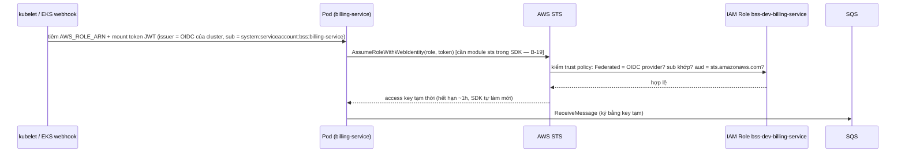

# 14 — Terraform & AWS: 7 module, 3 môi trường, IRSA, mạng, chi phí

> Mục tiêu bài: đọc hiểu **từng resource** Terraform, hiểu AWS phía sau, sửa B-30 → B-39 (+ B-19, B-21, B-34, B-35),
> và đưa ra quyết định kiến trúc có trade-off cho mạng dev. Thời lượng: 6h đọc + 12–16h lab. **Giai đoạn 4–5.**
> 💰 Bài này bắt đầu tốn tiền. Làm theo đúng thứ tự: `init → validate → plan (đọc kỹ) → apply → destroy`.

---

## 1. Ôn nhanh Terraform (handout 12) qua chính dự án

| Khái niệm | Ví dụ trong dự án |
|---|---|
| Provider | `hashicorp/aws ~> 5.0`, `tls ~> 4.0` (lấy thumbprint OIDC), `random ~> 3.0` (mật khẩu RDS) |
| Resource / Data source | `resource "aws_vpc"` tạo mới; `data "aws_availability_zones"` chỉ **đọc** thứ đã có |
| Variable / Output / Locals | `var.az_count`; `output "vpc_id"`; `locals { azs = slice(...) }` |
| Module | `modules/vpc` = "hàm"; `environments/dev/main.tf` gọi `module "vpc" { source = "../../modules/vpc" ... }` |
| State | Chưa bật remote (block `backend "s3"` đang comment) → state nằm file local |
| 1 state / môi trường | Mỗi thư mục env một state riêng ✅ (handout best practice) |
| `default_tags` | Mọi resource tự có tag `Project, Environment, ManagedBy, Owner` → lọc chi phí theo tag |

🔁 Đồ án bạn có 5 module `vpc/iam/ecr/eks/ec2`. Ở đây thêm `rds` (thay MongoDB EC2), `eventbridge` (hàng đợi), `observability` (log/trace); bỏ `ec2` (không còn Jenkins/Mongo EC2).

**Folder-per-env vs workspace:** dự án dùng thư mục riêng cho dev/staging/prod thay vì `terraform workspace`. ⚖️ Thư mục: rõ ràng, mỗi env có thể khác cấu trúc, khó "apply nhầm env"; đổi lại lặp code. Workspace: gọn nhưng dễ nhầm và mọi env buộc giống hệt nhau.

---

## 2. Kiểm chứng đầu tiên: Terraform chưa từng chạy

Tôi đã chạy trên bản sao trong thư mục tạm (không đụng repo):

```text
$ terraform fmt -check -recursive        → 6 file sai format (exit 3)
$ terraform init -backend=false          → Error: Function calls not allowed   (modules/eventbridge/variables.tf:12)
  (vá: đổi jsonencode(...) thành chuỗi JSON)
$ terraform validate                     → element types must all match for conversion to list  (module.iam.var.services)
  (vá: Resource luôn là list, hoặc kiểu `any`)
$ terraform validate                     → Success! (dev, staging, prod)
```

- **B-30**: `default` của `variable` phải là **giá trị hằng**, không được gọi hàm. Muốn dùng `jsonencode`, chuyển vào `locals` hoặc truyền từ nơi gọi module.
- **B-31**: `list(any)` yêu cầu **mọi phần tử cùng kiểu**. Object `{Effect, Action, Resource = "arn"}` và `{Effect, Action, Resource = ["arn"]}` là 2 kiểu khác nhau. 🧠 `any` trong Terraform không phải "gì cũng được" mà là "suy ra **một** kiểu cụ thể".

👉 Bài học lớn nhất của cả dự án: **đừng tin IaC chưa từng `validate/plan`**.

---

## 3. Module `vpc` — mạng

🔍 [modules/vpc/main.tf](../infrastructure/terraform/modules/vpc/main.tf)

### 3.1 Chia CIDR bằng `cidrsubnet`

```hcl
public_subnet_cidrs  = [for i in range(var.az_count) : cidrsubnet(var.vpc_cidr, 8, i)]
private_subnet_cidrs = [for i in range(var.az_count) : cidrsubnet(var.vpc_cidr, 8, i + 10)]
```

`cidrsubnet(prefix, newbits, netnum)`: thêm `newbits` bit vào prefix, lấy mạng con thứ `netnum`. `/16 + 8 = /24` (256 địa chỉ, AWS giữ 5).

| Env | VPC | Public | Private |
|---|---|---|---|
| dev (2 AZ) | 10.10.0.0/16 | 10.10.0.0/24, 10.10.1.0/24 | 10.10.10.0/24, 10.10.11.0/24 |
| staging (3 AZ) | 10.20.0.0/16 | 10.20.0–2.0/24 | 10.20.10–12.0/24 |
| prod (3 AZ) | 10.30.0.0/16 | 10.30.0–2.0/24 | 10.30.10–12.0/24 |

⚖️ Với EKS + VPC CNI, **mỗi Pod ăn 1 IP** của subnet. /24 private = ~250 IP cho cả node lẫn pod — đủ học, nhưng production thường dùng /19–/20 cho subnet pod. Ba VPC không trùng dải → sau này peering/Transit Gateway được.

🔁 Handout Linux/AWS: CIDR, subnet mask — giờ bạn tính bằng hàm thay vì tay. Thử trong `terraform console`: `cidrsubnet("10.10.0.0/16", 8, 10)`.

### 3.2 Từng resource

| Dòng | Resource | Ghi chú |
|---|---|---|
| 21–23 | `data aws_availability_zones` | Lấy AZ đang hoạt động; `slice(..., 0, az_count)` lấy N AZ đầu |
| 25–33 | `aws_vpc` | `enable_dns_hostnames/support = true` — **bắt buộc** cho EKS và VPC endpoint private DNS |
| 35–41 | `aws_internet_gateway` | Cổng ra Internet cho subnet public |
| 43–56 | `aws_subnet.public` (`count`) | `map_public_ip_on_launch`; tag `kubernetes.io/role/elb = 1` → ALB Controller tìm subnet đặt ALB public; tag `kubernetes.io/cluster/<name> = shared` |
| 58–70 | `aws_subnet.private` | tag `kubernetes.io/role/internal-elb = 1` cho LB nội bộ |
| 73–91 | `aws_eip` + `aws_nat_gateway` (`count = enable ? 1 : 0`) | **Chỉ 1 NAT** ở AZ đầu dù prod ghi "HA" (B-39). HA thật = 1 NAT mỗi AZ + route table riêng mỗi AZ |
| 94–109 | route table public: `0.0.0.0/0 → IGW` | |
| 111–123 | route table private với `dynamic "route"` | Chỉ thêm route ra NAT khi bật — ví dụ đẹp của `dynamic` |
| 132–153 | SG cho endpoint: cho 443 từ CIDR VPC | |
| 155–163 | S3 **Gateway** endpoint | Miễn phí; gắn vào route table private (ECR lưu layer image trên S3 nên cần cái này) |
| 165–175 | 5 **Interface** endpoint (`for_each` set) | Tính tiền theo giờ × AZ; `private_dns_enabled` → tên `sts.ap-southeast-1.amazonaws.com` tự phân giải về IP riêng |

🧠 `count` vs `for_each`: `count` đánh số `[0],[1]` — xóa phần tử giữa làm dịch chỉ số → Terraform **hủy và tạo lại** những cái sau. `for_each` dùng khóa ổn định (`["sts"]`) → an toàn khi thêm/bớt. Dự án dùng `count` cho subnet (ổn vì az_count ít đổi) và `for_each` cho endpoint (đúng).

### 3.3 B-32 — Quyết định mạng cho dev (viết thành ADR)

Node nằm private subnet, không NAT. Để một node EKS + addon + app hoạt động, cần đi tới: EKS API (có private endpoint ✅), ECR + S3 (✅), **EC2** (VPC CNI gán IP cho Pod ❌), **STS** (✅), **ELB** (ALB Controller ❌), **SQS/Events** (billing/order ❌), **SSM, X-Ray, CloudWatch Logs**..., và **Internet** cho image của Helm chart (quay.io, registry.k8s.io, public.ecr.aws, docker.io ❌ — không có endpoint nào thay được).

| Phương án | Chạy được? | 💰 Ước tính/ngày (dev 2 AZ, giá tham khảo) | ⚖️ |
|---|---|---|---|
| A. Như hiện tại (5 interface endpoint, không NAT) | ❌ | ~$3.1 | Vừa hỏng vừa đắt |
| B. Đủ ~12 interface endpoint + mirror image vào ECR | ✅ nhưng rất công sức | ~$7.5 | Đúng kiểu "private cluster" doanh nghiệp; quá sức cho dev học |
| C. **1 NAT Gateway** + S3 gateway endpoint, bỏ interface endpoint | ✅ | ~$1.4 + phí dữ liệu | **Khuyến nghị** — đơn giản, đúng mô hình staging/prod |
| D. Node ở public subnet (có IP public), SG chặt, không NAT | ✅ | ~$0 thêm | Rẻ nhất; kém an toàn (node có IP public) — chấp nhận được cho dev học, **không** cho prod |

> 💡 Giá thay đổi theo thời gian — tự kiểm tra: AWS Pricing Calculator, trang giá VPC (NAT Gateway, PrivateLink).

---

## 4. Module `eks`

🔍 [modules/eks/main.tf](../infrastructure/terraform/modules/eks/main.tf)

| Dòng | Resource | Giải thích |
|---|---|---|
| 11–29 | IAM role `cluster` tin `eks.amazonaws.com` + `AmazonEKSClusterPolicy` | Để control plane (do AWS chạy) tạo ENI, SG... trong VPC của bạn (🔁 handout 11 bước 1) |
| 31–53 | `aws_eks_cluster` | `vpc_config`: subnet private + public; `endpoint_private_access` + `public_access` với `public_access_cidrs` (dev 0.0.0.0/0, prod phải giới hạn IP) |
| 43 | `enabled_cluster_log_types` cả 5 | 💰 audit log ở dev khá tốn; dev có thể chỉ bật `api, audit` hoặc tắt |
| 45–48 | `access_config` `API_AND_CONFIG_MAP`, `bootstrap_cluster_creator_admin_permissions = true` | Người chạy `terraform apply` tự thành admin cluster. Các danh tính khác (GitHub deployer — B-34) phải thêm **access entry** |
| 56–66 | `data tls_certificate` + `aws_iam_openid_connect_provider` | Đăng ký "OIDC issuer" của cluster với IAM → nền tảng của **IRSA** |
| 69–98 | IAM role `node` tin `ec2.amazonaws.com` + 4 policy + instance profile | `AmazonEKSWorkerNodePolicy` (kubelet nói chuyện với EKS), `AmazonEKS_CNI_Policy` (VPC CNI gán IP), `AmazonEC2ContainerRegistryReadOnly` (kéo image ECR), `AmazonSSMManagedInstanceCore` (vào node bằng SSM thay SSH). Instance profile để Karpenter gắn cho node nó tạo |
| 102–130 | `aws_eks_node_group "system"` | Managed node group ON_DEMAND (system pod không nên chạy spot); `update_config.max_unavailable = 1`; label `role=system` |
| 133–144 | `aws_ec2_tag` `karpenter.sh/discovery` cho subnet private và cluster SG | EC2NodeClass của Karpenter chọn subnet/SG theo tag này |
| 147–167 | `aws_eks_addon` vpc-cni, coredns, kube-proxy, aws-ebs-csi-driver | Addon do EKS quản lý phiên bản. ⚠️ EBS CSI cần IAM (IRSA/Pod Identity với `AmazonEBSCSIDriverPolicy`) — thiếu (B-39/B-41) |

⚠️ **B-36** — `k8s_version = "1.30"`. EKS hỗ trợ mỗi version ~14 tháng standard + ~12 tháng extended (phí control plane **$0.60/h thay vì $0.10/h**). Kiểm tra: `aws eks describe-cluster-versions --query 'clusterVersions[].{v:clusterVersion,s:versionStatus}'` và chọn bản mới nhất "STANDARD_SUPPORT".

⚠️ Comment đầu file nói "module sets up the IAM role Karpenter needs" — **không có** (B-35). Karpenter cần: controller role (quyền EC2 CreateFleet/RunInstances/TerminateInstances, `iam:PassRole` node role, SSM đọc AMI, pricing), hàng đợi SQS nhận thông báo spot interruption + EventBridge rules, và access entry cho node role (managed node group đã tự tạo cho cùng role — Karpenter dùng lại role đó nên ổn).

---

## 5. IRSA — hiểu tận gốc (module `iam`)



🔍 [modules/iam/main.tf:13-36](../infrastructure/terraform/modules/iam/main.tf) — trust policy:

```hcl
Principal = { Federated = var.cluster_oidc_provider_arn }        # chỉ tin token do cluster này phát
Action    = "sts:AssumeRoleWithWebIdentity"
Condition = { StringEquals = {
  "<oidc-url>:sub" = "system:serviceaccount:bss:billing-service" # đúng namespace + tên SA
  "<oidc-url>:aud" = "sts.amazonaws.com"
}}
```

→ Pod khác (SA khác) trong cùng cluster **không** assume được role này. So với "Pod dùng quyền của node" (đồ án) — mọi Pod trên node có chung quyền → vi phạm least privilege.

🧠 Mẹo đọc cú pháp: `for_each = merge([for s, cfg in var.services : { for arn in cfg.managed_policy_arns : "${s}__${...}" => {...} }]...)` — tạo list các map rồi `merge(...)` với dấu `...` "trải" list thành nhiều đối số → một map phẳng, khóa duy nhất cho mỗi cặp (service, policy). Đây là idiom "flatten" phổ biến.

**GitHub OIDC** (dòng 67–141): provider `token.actions.githubusercontent.com`; trust `sub` dạng `repo:<owner>/<repo>:*`.
- ⚠️ `:*` = mọi nhánh, mọi PR, mọi tag, mọi environment của repo. Nên tách: role dev/staging tin `repo:X:ref:refs/heads/main` + `repo:X:ref:refs/tags/rc-v*`; role prod chỉ tin `repo:X:environment:production`.
- Thumbprint cứng: AWS hiện không còn kiểm thumbprint cho GitHub OIDC (dùng CA tin cậy), nhưng Terraform provider vẫn yêu cầu trường này — giữ nguyên được.
- ⚠️ Quyền chỉ ECR + `eks:DescribeCluster` → **B-34**. Cần thêm:

```hcl
resource "aws_eks_access_entry" "deployer" {
  cluster_name  = var.cluster_name
  principal_arn = aws_iam_role.github_actions_deployer[0].arn
}
resource "aws_eks_access_policy_association" "deployer_bss" {
  cluster_name  = var.cluster_name
  principal_arn = aws_iam_role.github_actions_deployer[0].arn
  policy_arn    = "arn:aws:eks::aws:cluster-access-policy/AmazonEKSEditPolicy"
  access_scope { type = "namespace"; namespaces = ["bss"] }
}
```
(Viết đúng cú pháp HCL nhiều dòng khi áp dụng — ở trên rút gọn để đọc.)

⚖️ **IRSA vs EKS Pod Identity**: Pod Identity (addon `eks-pod-identity-agent` + `aws_eks_pod_identity_association`) không cần OIDC provider, trust policy chung `pods.eks.amazonaws.com`, gắn role ↔ SA bằng API thay vì annotation. Mới hơn, đơn giản hơn; IRSA vẫn phổ biến và chạy mọi nơi. Với addon mới (B-35) có thể thử Pod Identity để so sánh.

---

## 6. Module `rds`

🔍 [modules/rds/main.tf](../infrastructure/terraform/modules/rds/main.tf)

| Dòng | Resource | Ghi chú |
|---|---|---|
| 9–12 | `random_password` 24 ký tự | Mật khẩu **nằm trong state** Terraform (dạng rõ) → state phải mã hóa + giới hạn quyền (bucket có SSE + chặn public ✅) |
| 14–28 | Secret `bss-dev/rds/master` chứa JSON `{username,password,host,port}` | ⚠️ thiếu `recovery_window_in_days = 0` cho dev (B-37). ⚖️ Cách hiện đại: `manage_master_user_password = true` — RDS tự tạo & xoay vòng secret, mật khẩu không vào state |
| 30–35 | `aws_db_subnet_group` private subnet | RDS không có IP public |
| 37–58 | SG: 5432 **chỉ từ SG node EKS** | Tham chiếu SG thay vì CIDR — chuẩn |
| 60–75 | Parameter group `postgres15`: `log_statement=all`, `log_min_duration_statement=1000` | ⚠️ `all` ghi mọi câu SQL (kể cả dữ liệu cá nhân trong câu lệnh) → tốn CloudWatch + rủi ro PII. Dev: `ddl` hoặc `none`; giữ slow query > 1s |
| 77–110 | `aws_db_instance` | gp3, `storage_encrypted`, `publicly_accessible = false`, `multi_az` theo env, backup window 16:00 UTC (= 23:00 ICT), `iam_database_authentication_enabled`, `deletion_protection` + `skip_final_snapshot = !deletion_protection` (dev không snapshot khi xóa), `apply_immediately` ở dev |

⚠️ **B-21**: chỉ tạo DB `bss`. ⚠️ **B-36**: `engine_version = "15.5"` — dùng `"15"` (AWS tự chọn minor mới nhất) hoặc kiểm tra `aws rds describe-db-engine-versions --engine postgres --query "DBEngineVersions[].EngineVersion"`. Cân nhắc nâng lên Postgres 16/17 (nhớ đổi family parameter group).

---

## 7. Module `ecr`, `eventbridge`, `observability`

**ECR** ([modules/ecr/main.tf](../infrastructure/terraform/modules/ecr/main.tf)): `for_each` 7 service → repo `bss/<service>`; `IMMUTABLE`; `scan_on_push` (quét cơ bản); lifecycle: giữ 20 image có tag, xóa image không tag sau 1 ngày. ⚠️ Rule "giữ 20 tag gần nhất" sẽ xóa cả tag `v1.0.0` đang chạy prod nếu có 20 SHA mới hơn → nên có rule ưu tiên cao giữ `v*`. ⚠️ Thiếu `force_delete` cho dev (B-37). ⚠️ Thuộc về stack dùng chung (B-33).

**EventBridge** ([modules/eventbridge/main.tf](../infrastructure/terraform/modules/eventbridge/main.tf)):
- `aws_cloudwatch_event_bus` (tên API cũ của EventBridge là CloudWatch Events).
- Mỗi consumer (`billing-orders`): DLQ (giữ 14 ngày) + queue chính (visibility 60s, giữ 4 ngày, redrive sau 5 lần).
- `aws_sqs_queue_policy`: cho `events.amazonaws.com` gửi vào queue **với điều kiện `aws:SourceArn` = đúng rule này** — chống "confused deputy" (dịch vụ AWS bị lợi dụng gửi hộ từ rule của người khác).
- Target có `dead_letter_config` + `retry_policy` (EventBridge → SQS thất bại thì thử 3 lần / tối đa 1 giờ, rồi vào DLQ). ⚠️ DLQ cũng cần queue policy cho EventBridge — hiện chưa có.
- Alarm `ApproximateNumberOfMessagesVisible > 0` trên DLQ — ⚠️ chưa có `alarm_actions` (SNS → email) nên alarm "kêu trong im lặng".

**Observability** ([modules/observability/main.tf](../infrastructure/terraform/modules/observability/main.tf)): 3 log group `/aws/eks/<cluster>/{application,dataplane,host}` với retention theo env; X-Ray sampling rule (`reservoir_size = 1` = luôn lấy ít nhất 1 trace/giây, sau đó `fixed_rate`).

---

## 8. Ba môi trường — khác nhau ở đâu

| Thuộc tính | dev | staging | prod |
|---|---|---|---|
| VPC / AZ | 10.10/16, 2 | 10.20/16, 3 | 10.30/16, 3 |
| NAT / endpoints | không / có | 1 / có | 1 / có |
| Node system | t3.medium 2–3 | t3.large 2–5 | t3.large 3–6 |
| RDS | micro, 20GB, backup 1 ngày, không bảo vệ xóa | small, 50GB, 7 ngày, PI, bảo vệ xóa | medium, 100GB, **multi-AZ**, 30 ngày |
| Log / X-Ray | 3 ngày / 50% | 14 / 20% | 30 / 5% |
| GitHub OIDC | tạo | không | không |
| `public_access_cidrs` | mặc định 0.0.0.0/0 | mặc định 0.0.0.0/0 | **bắt buộc truyền** (không default) |

---

## 9. Tái cấu trúc đề xuất (B-33, B-35, B-38)

```
infrastructure/terraform/
├── bootstrap/            (thay scripts/bootstrap-aws.sh — tùy chọn) S3 state bucket tên có account id
├── modules/
│   ├── ... (7 module cũ, đã sửa)
│   ├── platform-iam/     role cho ALB controller, ExternalDNS, EBS CSI, Karpenter (+SQS interruption), Fluent Bit, OTel
│   └── db-bootstrap/     (tùy chọn) provider postgresql tạo DB/user từng service
└── environments/
    ├── shared/           ECR 7 repo, GitHub OIDC provider, role deployer-nonprod + deployer-prod, (Route 53 zone)
    ├── dev/              đọc output shared qua terraform_remote_state
    ├── staging/
    └── prod/
```

Nguyên tắc: **tài nguyên sống lâu hơn một môi trường thì không nằm trong state của môi trường đó.**

---

## 10. Remote state & bootstrap

🔍 [scripts/bootstrap-aws.sh](../scripts/bootstrap-aws.sh) — tạo bucket (versioning, SSE-AES256, chặn public) + bảng DynamoDB `LockID` + budget 80% ngưỡng. Kiểm tra "đã có thì bỏ qua" → **idempotent** (chạy lại an toàn).

- ⚠️ Tên bucket là **toàn cầu** → đổi thành `bss-tfstate-${ACCOUNT_ID}` (B-38).
- `create-bucket --create-bucket-configuration LocationConstraint=...` — đúng cho mọi region trừ `us-east-1`.
- Budget chỉ báo ở 80% — thêm mức 100% và "forecasted".
- Sau bootstrap: bỏ comment block `backend "s3"` ở mỗi env (key khác nhau: `dev/terraform.tfstate`...). Với Terraform ≥ 1.10 có thể dùng `use_lockfile = true` thay DynamoDB.

---

## 11. 💰 Chi phí thực tế (dev chạy 24h, giá tham khảo ap-southeast-1)

| Hạng mục | $/ngày |
|---|---|
| EKS control plane ($0.10/h) | 2.40 |
| 2 × t3.medium on-demand | ~2.50 |
| RDS db.t3.micro + 20GB | ~0.70 |
| Mạng: 5 interface endpoint × 2 AZ (thiết kế hiện tại) **hoặc** 1 NAT | ~3.10 **hoặc** ~1.40 |
| ALB | ~0.60 + LCU |
| CloudWatch (control-plane log 5 loại + log app) | 0.20–1.00 tùy lượng |
| Tổng | **~$8–10/ngày** nếu để 24h (CLAUDE.md ước $5) |

Chiến lược: chỉ bật khi học (vd. 4h/ngày ≈ $1.5–2/ngày) + destroy tối → ~$40–60/tháng; làm **mọi thứ có thể trên kind trước** (Giai đoạn 2) để giảm số giờ EKS. Kiểm tra chính sách Free Tier/credit của tài khoản bạn khi tạo (đã đổi từ 7/2025).

---

## 12. Destroy sạch — thứ tự đúng (B-37)

```bash
kubectl delete ingress --all -A                 # để ALB Controller xóa ALB + target group
kubectl delete nodepools --all                  # Karpenter terminate node của nó
kubectl get svc -A | grep LoadBalancer          # còn Service type LoadBalancer nào không
# chờ 1–3 phút, kiểm tra EC2 → Load Balancers trống
terraform destroy
python tools/ops/orphan_finder.py --tag Project=bss-platform   # (script bạn sẽ viết) còn ENI/EIP/EBS nào sót
```

---

## 13. Labs

| Lab | Nội dung | Lỗi | Đạt khi |
|---|---|---|---|
| 14.1 | `terraform fmt -recursive`; sửa B-30, B-31; `init -backend=false && validate` 3 env | B-30, B-31, B-39 | validate xanh, fmt sạch |
| 14.2 | `terraform console`: tính `cidrsubnet` cho 3 env; vẽ sơ đồ VPC dev trên giấy | — | Sơ đồ trong nhật ký |
| 14.3 | Viết ADR-001 mạng dev (chọn C hoặc D), sửa module vpc | B-32 | ADR trong `docs/adr/` |
| 14.4 | Tạo AWS account/IAM/MFA/budget (course 06); bootstrap với tên bucket mới; bật backend | B-38 | `terraform init` dùng S3 |
| 14.5 | Tách `environments/shared` (ECR, GitHub OIDC, 2 deployer role + access entry) | B-33, B-34 | plan shared sạch |
| 14.6 | Nâng EKS/RDS version; `recovery_window_in_days = 0`, `force_delete` cho dev | B-36, B-37 | plan không lỗi |
| 14.7 | Module `platform-iam` (ít nhất ALB controller + EBS CSI) | B-35 | output ARN |
| 14.8 | `terraform plan` dev → đọc từng dòng "+ create" → apply → `kubectl get nodes` Ready | — | 2 node Ready |
| 14.9 | Drift: sửa tay tag VPC trên Console → `plan` phát hiện → apply trả lại | — | Hiểu vì sao cấm click Console |
| 14.10 | Destroy theo mục 12; kiểm tra Billing hôm sau | B-37 | Không còn tài nguyên tính tiền |

## 14. Tự kiểm tra

1. Vì sao `default` của variable không được gọi hàm? Đưa `jsonencode` vào đâu?
2. `cidrsubnet("10.20.0.0/16", 8, 12)` = ? Đó là subnet gì của env nào?
3. Trình bày 4 điều kiện trong trust policy IRSA và điều gì xảy ra nếu bỏ điều kiện `sub`.
4. Vì sao interface endpoint không thay được NAT cho việc kéo image từ `quay.io`?
5. Mật khẩu RDS nằm ở những nơi nào? Làm sao để nó không nằm trong state?
6. Vì sao ECR và GitHub OIDC provider không nên nằm trong state của môi trường dev?
7. `aws:SourceArn` trong queue policy chống kiểu tấn công nào?
