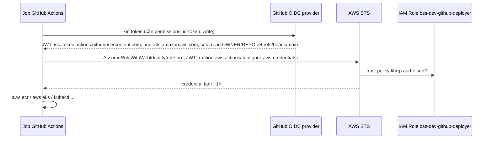

# 15 — CI/CD: GitHub Actions, OIDC, promotion bằng tag

> Mục tiêu bài: đọc hiểu 7 workflow, hiểu OIDC từ GitHub sang AWS, nhận ra **lỗi thiết kế** B-50/B-51 và thiết kế lại
> chuỗi "build once, deploy many" cho đúng. Thời lượng: 4h đọc + 10h lab. **Giai đoạn 3 (CI) và 6 (CD).**

---

## 1. Từ Jenkins sang GitHub Actions

🔁 Bảng ánh xạ đầy đủ 12 stage Jenkins của bạn nằm ở [02 mục 2](02-cau-noi-kien-thuc.md). Tóm tắt khái niệm:

```
workflow (file .yml)
 └─ on: sự kiện kích hoạt (pull_request, push, tag, workflow_dispatch, schedule)
 └─ jobs: chạy SONG SONG trên runner riêng, trừ khi có `needs:`
     └─ steps: chạy TUẦN TỰ trong 1 runner
         ├─ uses: org/action@version   (action có sẵn — như plugin Jenkins)
         └─ run: lệnh shell
```

- Runner `ubuntu-latest` là **VM mới tinh mỗi job** → không có "file root sót lại", không cần cleanup disk như Jenkins EC2 của bạn; đổi lại mỗi lần phải cài lại tool (dùng cache).
- `outputs` của job → truyền dữ liệu sang job khác (`needs.detect.outputs.services`).
- `strategy.matrix` → nhân một job thành N job song song (mỗi service một job).
- `concurrency` → hủy lần chạy cũ khi có lần mới trên cùng nhánh.
- `permissions` → quyền của `GITHUB_TOKEN` và quyền xin **OIDC token** (`id-token: write`).

---

## 2. OIDC: GitHub → AWS không cần access key



Các dạng `sub` cần thuộc (dùng để viết trust policy chặt):

| Tình huống | `sub` |
|---|---|
| push nhánh main | `repo:OWNER/REPO:ref:refs/heads/main` |
| push tag | `repo:OWNER/REPO:ref:refs/tags/rc-v1.2.0` |
| pull request | `repo:OWNER/REPO:pull_request` |
| job có `environment: production` | `repo:OWNER/REPO:environment:production` |

🔁 Cùng triết lý với "Jenkins dùng IAM Role gắn EC2, không lưu key" trong đồ án — khác ở chỗ GitHub không phải máy của bạn, nên cần **liên kết danh tính** (federation) thay vì instance profile.

⚠️ Trust hiện tại `repo:<repo>:*` → mọi PR/nhánh/tag đều assume được role deploy. Kết hợp với `ci-terraform.yml` chạy trên `pull_request` → PR của bất kỳ ai có quyền push nhánh cũng có credential AWS. (PR từ **fork** mặc định không nhận được OIDC token/secrets — nhưng vẫn nên khóa chặt.)

---

## 3. CI — đọc từng workflow

### 3.1 `ci-backend.yml`

🔍 [ci-backend.yml](../.github/workflows/ci-backend.yml)

| Dòng | Nội dung | Ghi chú |
|---|---|---|
| 3–13 | Chạy khi PR hoặc push main đụng `apps/backend/**`, `packages/bss-common-java/**` | Path filter cấp workflow |
| 15–17 | `concurrency: ci-backend-${{ github.ref }}` + cancel | PR push liên tục → chỉ giữ lần mới nhất |
| 20–35 | Job `detect`: `dorny/paths-filter` → output `changes` = JSON list service thay đổi, vd `["customer-service"]` | ⚠️ Không có filter cho `packages/bss-common-java` → sửa lib không build service nào (B-53) |
| 37–45 | `build-and-test` matrix theo list đó; `if: != '[]'` | |
| 49–53 | `setup-java` temurin 21 + `cache: maven` | Cache `~/.m2` theo hash `pom.xml` |
| 55–57 | `mvn -B verify` | ⚠️ Có thể không chạy test IT nào (B-09) — **đọc số `Tests run`** |
| 59–61 | `docker build` | ⚠️ Đỏ do B-01 |
| 63–69 | Trivy `HIGH,CRITICAL`, `exit-code: 1`, `ignore-unfixed` | Gate bảo mật: có CVE đã có bản vá → fail |

### 3.2 `ci-frontend.yml`

🔍 [ci-frontend.yml](../.github/workflows/ci-frontend.yml) — tương tự; `setup-node` + `cache: npm` với `cache-dependency-path` trỏ `package-lock.json` **không tồn tại** → lỗi ngay bước setup; sau đó lint (không config), test (không file test) → B-04.

### 3.3 `ci-terraform.yml`

🔍 [ci-terraform.yml](../.github/workflows/ci-terraform.yml)

| Job | Làm gì | Hiện trạng |
|---|---|---|
| `fmt-validate` | `terraform fmt -check -recursive` | ❌ 6 file sai format. Tên job có "validate" nhưng **không chạy `validate`** (cần `init -backend=false` trước) |
| `security-scan` | `tfsec-action` | ❌ sẽ báo nhiều mục; tfsec đã gộp vào Trivy (`trivy config`) |
| `plan-dev` | OIDC → `init` → `plan` → comment PR | ❌ backend chưa bật (state local rỗng → plan "tạo mọi thứ"), thiếu biến `owner_email` → lỗi `-input=false` |

Mẫu cải tiến: job `validate` chạy ma trận 3 env (`init -backend=false && validate`), `trivy config --severity HIGH,CRITICAL`, plan chỉ chạy khi có nhãn PR `plan` và backend đã sẵn sàng, biến qua `TF_VAR_owner_email` từ `vars`.

### 3.4 `ci-k8s.yml`

🔍 [ci-k8s.yml](../.github/workflows/ci-k8s.yml) — build 3 overlay bằng kustomize và kiểm schema bằng `kubeconform -strict -ignore-missing-schemas`. Nhiều khả năng **xanh** (tôi đã build thử 3 overlay thành công). Nâng cấp: thêm schema cho CRD (PrometheusRule, NodePool...) thay vì bỏ qua; thêm `kube-linter`/`polaris` để bắt lỗi best practice (thiếu probe, chạy root).

---

## 4. CD — đọc từng workflow

### 4.1 `cd-dev.yml`

🔍 [cd-dev.yml](../.github/workflows/cd-dev.yml)

```
push main (apps/**) → detect (7 filter) → build-push (matrix: service thay đổi)
                                            docker build + push  <ECR>/bss/<svc>:<github.sha>
                                        → deploy
                                            update-kubeconfig
                                            kustomize edit set image <svc>=<ECR>/bss/<svc>:<sha>   (chỉ service thay đổi)
                                            kubectl apply -k overlays/dev                          (TẤT CẢ service)
                                            rollout status (service thay đổi) || rollout undo
                                            smoke: curl .../api/actuator/health || true
```

⚠️ **B-50**: file overlay sửa trong runner **không được commit**. Trong git, 6 service còn lại vẫn là `CHANGE_ME...:dev` → `kubectl apply -k` đẩy image không tồn tại cho chúng. Hậu quả: mỗi lần deploy 1 service, 6 service kia `ImagePullBackOff` (bản cũ vẫn chạy vì `maxUnavailable: 0`, nhưng Deployment kẹt ở rollout dở dang và mọi rollout sau đều hỏng).

⚠️ **B-52**: smoke `|| true` + path không tồn tại qua gateway → không bao giờ fail.

⚠️ Thiếu `concurrency` → 2 merge liên tiếp chạy song song, deploy đè nhau.

⚠️ `kubectl apply` cần access entry (B-34) — nếu không có, fail ngay bước apply.

### 4.2 `cd-staging.yml` và `cd-prod.yml`

🔍 [cd-staging.yml](../.github/workflows/cd-staging.yml) — tag `rc-v*` → `git rev-parse HEAD` (SHA mà tag trỏ tới) → với **7 service**: `docker pull <svc>:<sha>` (không có thì `skip`) → `docker tag` → push `:<rc-vX>` → `kustomize edit set image` **cả 7** sang `:rc-vX` → apply → chờ mọi deployment → curl health (không kiểm nội dung).

🔍 [cd-prod.yml](../.github/workflows/cd-prod.yml) — tag `vX.Y.Z` (bộ lọc glob `v[0-9]+.[0-9]+.[0-9]+` — GitHub hỗ trợ `+` và `[0-9]`) → `environment: production` (**chờ người duyệt** nếu đã cấu hình Environment) → role `AWS_PROD_DEPLOYER_ROLE_ARN` (⚠️ role không tồn tại — B-33) → re-tag `rc-vX` → `vX` → apply → từng deployment: fail thì `rollout undo` **deployment đó** rồi dừng (⚠️ các deployment trước đó giữ bản mới → hệ thống lẫn phiên bản).

⚠️ **B-51**: vì cd-dev chỉ build service thay đổi, tại một SHA bất kỳ thường chỉ có 1–2 image. Staging bỏ qua 5–6 service khi re-tag nhưng vẫn set `:rc-vX` cho chúng → `ImagePullBackOff`.

---

## 5. Thiết kế lại: "nguồn sự thật" về phiên bản đang chạy

Câu hỏi cốt lõi của CD: **"Ở môi trường X, service Y đang chạy image nào — và thông tin đó được lưu ở đâu?"** Hiện tại: không ở đâu cả.

| Phương án | Cách làm | Ưu | Nhược |
|---|---|---|---|
| **A. GitOps-lite (khuyến nghị để học)** | cd-dev build → bot **commit** `overlays/dev/kustomization.yaml` với tag mới (message `[skip ci]`) → apply từ file đã commit. Promotion: copy khối `images:` từ overlay dev sang staging (PR tự động) → tag `rc-vX` | Git là nguồn sự thật; xem lịch sử deploy bằng `git log`; rollback = revert commit. 🔁 Giống hệt stage "Bump version + [skip ci]" của bạn | Bot cần quyền push; phải tránh vòng lặp |
| **B. GitOps chuẩn (ArgoCD)** | Như A nhưng ArgoCD trong cluster tự kéo git về, CI không cần `kubectl` | Không cần credential cluster trong CI; tự sửa drift | Thêm một hệ thống phải vận hành |
| C. Build tất cả mỗi lần | Mỗi merge build đủ 7 image cùng SHA | Rất đơn giản, SHA nào cũng đủ 7 image | Tốn thời gian/tiền CI; image giống hệt nhau vẫn build lại |
| D. Chỉ `kubectl set image` service thay đổi | Không `apply -k` toàn bộ | Sửa nhanh B-50 | Cluster lệch khỏi git (drift), không có lịch sử |

Promotion image hiệu quả (không cần pull/push layer):

```bash
MANIFEST=$(aws ecr batch-get-image --repository-name bss/customer-service \
  --image-ids imageTag=$SHA --query 'images[0].imageManifest' --output text)
aws ecr put-image --repository-name bss/customer-service --image-tag rc-v1.2.0 --image-manifest "$MANIFEST"
```

---

## 6. Vệ sinh pipeline (B-54)

- **Ghim action theo commit SHA** (`uses: actions/checkout@<40-ký-tự-sha> # v4`) + Dependabot cập nhật. Sự cố `tj-actions/changed-files` (3/2025) là ví dụ tag bị sửa để chèn mã độc.
- `permissions:` tối thiểu ở mức workflow (`contents: read`), mở rộng từng job khi cần.
- `ECR_REGISTRY` → `vars.ECR_REGISTRY` (không phải bí mật). Role ARN cũng không phải bí mật, nhưng để trong secrets vẫn chấp nhận được.
- **GitHub Environments**: `staging` (không duyệt), `production` (Required reviewers + chỉ cho tag `v*`) — secrets theo environment.
- **Branch protection** cho `main`: bắt PR + CI xanh + 1 review (tự review cũng được khi làm một mình — thói quen tốt).
- **Reusable workflow** (`workflow_call`) cho 3 file CD đang lặp — tương đương Jenkins Shared Library (🔁 handout 8).
- Smoke test thật: gọi `scripts/e2e-*.sh` hoặc `tools/ops/health_check.py` (bài 02 mục 5.1), fail = exit ≠ 0.
- DORA metrics (course 11): deployment frequency, lead time, change failure rate, MTTR — đo được khi pipeline chạy thật.

---

## 7. Labs

| Lab | Nội dung | Lỗi | Đạt khi |
|---|---|---|---|
| 15.1 | Push repo lên GitHub (đã có remote của bạn), bật branch protection | — | PR bắt buộc |
| 15.2 | Làm CI backend xanh (sau B-01, B-09): đọc log, xác nhận số test | B-53 | ✅ + `Tests run > 0` |
| 15.3 | Làm CI frontend xanh (sau B-04) | B-53 | ✅ |
| 15.4 | Sửa ci-terraform: fmt, validate ma trận, trivy config, tạm tắt plan | B-53 | ✅ |
| 15.5 | Thêm filter `packages/bss-common-java` → build mọi backend | B-53 | PR sửa lib build 5 job |
| 15.6 | Ghim SHA cho mọi action + Dependabot `github-actions` | B-54 | — |
| 15.7 | (Giai đoạn 6) Viết ADR-002 chọn phương án A/B/C/D; hiện thực A | B-50, B-51 | Merge 2 service liên tiếp, cả 7 service vẫn Running |
| 15.8 | Smoke test thật + rollback khi fail; thêm `concurrency` cho cd-dev | B-52, B-54 | Cố tình deploy bản trả 500 → tự rollback |
| 15.9 | Environments + trust policy tách dev/prod theo `sub` | B-33, B-39 | PR không assume được role prod |
| 15.10 | Promotion bằng `ecr put-image`; tag `rc-v0.1.0` → staging; `v0.1.0` → duyệt → prod | — | Luồng promotion hoàn chỉnh |

## 8. Tự kiểm tra

1. Job và step khác nhau thế nào về môi trường chạy?
2. Viết trust policy condition chỉ cho phép job có `environment: production` assume role prod.
3. Vì sao cd-dev hiện tại phá các service không thay đổi? Nêu 2 cách sửa và trade-off.
4. "Build once, deploy many" gãy ở đâu khi kết hợp với path-filter?
5. Vì sao nên ghim action theo SHA thay vì tag `@v4`?
6. `|| true` trong bước smoke test gây hậu quả gì cho auto-rollback?
