# 20 — Lộ trình hoàn thành dự án (9 giai đoạn, ~20–24 tuần part-time)

> Đây là **kim chỉ nam hàng tuần**. Mỗi giai đoạn có: mục tiêu · bài cần đọc · việc cần làm (kèm mã lỗi B-xx) ·
> checkpoint đo được · chi phí · câu gợi ý để làm cùng Claude.
> Nhịp giả định: **10–12 giờ/tuần**. Học nhanh hơn thì gộp tuần, đừng bỏ checkpoint.

---

## 0. Nguyên tắc của lộ trình

1. **Local trước, cloud sau.** Mọi thứ kiểm được trên laptop (code, Docker, K8s, Prometheus, CI) phải xanh trước khi trả tiền AWS. Giai đoạn 0–3 tốn **$0**.
2. **Sửa theo nhu cầu của bước đang làm**, không theo độ nghiêm trọng. Lỗi Terraform (P0) chưa cần sửa khi bạn đang làm local.
3. **Mỗi lỗi = 1 issue + 1 nhánh + 1 PR.** Lỗi logic: test đỏ trước, sửa sau.
4. **Mỗi quyết định kiến trúc = 1 ADR** trong `docs/adr/` (1 trang: bối cảnh, lựa chọn, quyết định, hệ quả).
5. **Không nhảy giai đoạn** khi checkpoint chưa đạt (quy ước CLAUDE.md §9).
6. **Destroy mỗi tối** khi đã lên AWS.

### Ánh xạ với Phase trong CLAUDE.md và module course của thầy

| Giai đoạn (sổ tay) | Phase CLAUDE.md | Module `course/` |
|---|---|---|
| 0 Chuẩn bị | 0 | 01 |
| 1 Local chạy thật | 1 | 02, 03 |
| 2 K8s local + observability local | (chuẩn bị 3, 7) | 04, 05, 12 (một phần) |
| 3 CI xanh | 5 (phần CI) | 10 (một phần) |
| 4 Terraform + AWS | 2, 3 | 06, 07, 08 |
| 5 Deploy dev EKS | 3, 4 | 08, 09 |
| 6 CD dev → staging → prod | 5, 8 | 10, 11 |
| 7 Observability + security trên AWS | 7, 9 | 12, 13 |
| 8 Reliability, tài liệu, demo | 9, 10 | 14, 15 |

```mermaid
gantt
    title Lộ trình BSS Platform (tuần, ~10–12h/tuần)
    dateFormat  X
    axisFormat  T%s
    section Local ($0)
    GĐ0 Chuẩn bị             :g0, 0, 1
    GĐ1 Local chạy thật      :g1, 1, 4
    GĐ2 K8s local + monitor  :g2, 4, 7
    GĐ3 CI xanh              :g3, 7, 9
    section AWS ($)
    GĐ4 Terraform + AWS      :g4, 9, 12
    GĐ5 Deploy dev EKS       :g5, 12, 14
    GĐ6 CD + promotion       :g6, 14, 17
    GĐ7 Observability + Sec  :g7, 17, 20
    GĐ8 Reliability + Demo   :g8, 20, 23
```

---

## Giai đoạn 0 — Chuẩn bị & định hướng (tuần 1)

**Mục tiêu:** môi trường làm việc giống CI; hiểu dự án ở mức tổng thể; thống nhất phạm vi với thầy.

**Đọc:** [README](README.md), [00](00-tong-quan-du-an.md), [01](01-hien-trang-va-danh-sach-loi.md), [02](02-cau-noi-kien-thuc.md), bài này.

**Việc cần làm**
- [ ] Cài WSL2 + Ubuntu; clone repo vào `~/code/bss-platform` (xem [12 mục 0](12-docker-va-local-dev.md)).
- [ ] Cài trong WSL: JDK 21, Maven 3.9, Node 20, Docker (tích hợp Desktop), kubectl, kind, helm, terraform, awscli, jq, yq, trivy.
- [ ] `.gitattributes` + khôi phục quyền thực thi script (**B-07**) — PR đầu tiên của bạn.
- [ ] Tạo GitHub Issues cho toàn bộ B-xx (label `P0/P1/P2` + `area/*`); tạo Project board (Todo/Doing/Done).
- [ ] Bật branch protection cho `main`.
- [ ] Gặp thầy với danh sách câu hỏi ở mục 11.
- [ ] Mở [nhật ký](nhat-ky-hoc-tap.md), ghi buổi đầu.

**Checkpoint:** `java -version` (21), `mvn -v`, `docker run hello-world`, `kind version`, `make help` chạy trong WSL; board có ≥ 40 issue.

💰 $0 · 🤖 *"Đọc learning/01 và tạo cho tôi script `gh issue create` cho tất cả lỗi B-xx với label phù hợp. Đừng chạy, để tôi xem trước."*

---

## Giai đoạn 1 — Local chạy thật end-to-end (tuần 2–4)

**Mục tiêu:** trên laptop, luồng *tạo khách → xem gói → đặt hàng → nhận hóa đơn* chạy thật qua gateway + UI; 7 image build được; test thật sự chạy.

**Đọc:** [10](10-backend-java-spring.md), [11](11-frontend-react-vite.md), [12](12-docker-va-local-dev.md), [17](17-makefile-scripts-repo.md).

**Việc cần làm (theo thứ tự)**
1. [ ] `mvn -B verify` từng service; điều tra số test chạy; thêm failsafe (**B-09**).
2. [ ] `make local-up`; dọn docker-compose (**B-08**).
3. [ ] `application-local.yml` × 5 + route gateway local; sửa route rút gọn (**B-02**, **B-03**).
4. [ ] `scripts/e2e-local.sh` biết fail (nền cho B-52).
5. [ ] Sửa lỗi logic, **test trước**: **B-10** (mất hóa đơn) → **B-11** (khóa chống trùng) → **B-12** (SKIP LOCKED) → B-14, B-15 (phân trang, mass-assignment).
6. [ ] **B-13**: order lấy giá từ product-catalog + Resilience4j (có thể dời sang GĐ 8 nếu quá tải).
7. [ ] Metrics: histogram + tag `application` (**B-16**); thêm `sts` (**B-19**).
8. [ ] Frontend: lockfile, ESLint, test (**B-04**); chạy UI qua Vite proxy.
9. [ ] Dockerfile: 5 backend (**B-01**) + Nginx unprivileged (**B-05**) + `.dockerignore`; build 7 image; Trivy.
10. [ ] Ghi ADR-000 "Cách chạy local" (port, profile) vào `docs/adr/`.

**Checkpoint:**
- `scripts/e2e-local.sh` → PASS (exit 0) từ trạng thái `docker compose down -v`.
- Đặt hàng trên UI web-portal → trang Hóa đơn hiện hóa đơn VAT 10%.
- Mọi service: `Tests run > 0`, xanh. Có test tái hiện B-10 (đã xanh).
- `docker images` có 7 image; Trivy 0 HIGH/CRITICAL (hoặc `.trivyignore` có lý do).
- Tắt LocalStack, đặt 3 đơn, bật lại → đủ 3 hóa đơn, không trùng.

💰 $0 · 🤖 *"Tôi đang làm B-10. Đây là test tôi viết để tái hiện: <dán>. Nó đã đỏ chưa đúng lý do chưa? Đừng sửa code chính."*

---

## Giai đoạn 2 — Kubernetes local (kind) + Observability local (tuần 5–7)

**Mục tiêu:** toàn hệ thống chạy trên kind bằng Kustomize, có metrics/dashboard/alert thật — **kiến trúc K8s đúng trước khi trả tiền EKS**.

**Đọc:** [13](13-kubernetes-kustomize.md), [16](16-platform-addons-observability.md) (phần Helm, Prometheus).

**Việc cần làm**
1. [ ] kind cluster + ingress-nginx + metrics-server (**B-43**).
2. [ ] `overlays/local`: Postgres StatefulSet + init DB, LocalStack, `secretGenerator` (**B-20** bản local), HPA min 1 (**B-22**), bỏ IRSA, Ingress class nginx.
3. [ ] Sửa base: `labels` thay `commonLabels`, `ingressClassName`, `envFrom` + biến Spring đúng tên, Service thêm nhãn `tier` (**B-24**).
4. [ ] kube-prometheus-stack (values local) + **ServiceMonitor** (**B-40**) + dashboard + alerts; receiver Discord/Slack (**B-42** phần Alertmanager).
5. [ ] Nhãn Pod Security `restricted` cho namespace `bss` (**B-25**).
6. [ ] admin-console dưới `/admin` (**B-06**).
7. [ ] Lab probe, rolling update/rollback, 5 bug debug (course 04).
8. [ ] k6: `tests/load/plans-and-order.js` → quan sát HPA.
9. [ ] Viết runbook đầu tiên `docs/runbooks/bss-high-error-rate.md`.

**Checkpoint:**
- `kubectl -n bss get pods` — 7 service + Postgres + LocalStack đều `Running/Ready`.
- E2E qua `http://bss.localtest.me` PASS.
- Grafana dashboard BSS có số liệu; ép lỗi 500 → alert tới Discord/Slack trong ≤ 10 phút.
- k6 ở 50 VU → HPA tăng pod; dừng tải → giảm sau ~5 phút.

💰 $0 · 🤖 *"Hỏi tôi 10 câu về probes, HPA, PDB dựa trên chính overlays/local tôi vừa viết. Chấm điểm."*

---

## Giai đoạn 3 — CI xanh trên GitHub (tuần 8–9)

**Mục tiêu:** mọi PR tự kiểm; không cần AWS.

**Đọc:** [15](15-cicd-github-actions.md) mục 1–3, 6.

**Việc cần làm**
1. [ ] ci-backend xanh + filter cho `bss-common-java` (**B-53**).
2. [ ] ci-frontend xanh.
3. [ ] ci-terraform: `fmt` (sửa 6 file — phần đầu của **B-39**), sửa **B-30**, **B-31**, validate ma trận 3 env với `-backend=false`, `trivy config`; tạm tắt job plan.
4. [ ] ci-k8s: thêm build `overlays/local`; (tùy chọn) kube-linter.
5. [ ] Ghim action theo SHA + Dependabot (**B-54**).
6. [ ] (Tùy chọn, 5.6 bài 02) publish `bss-common-java` lên GitHub Packages và dùng ở 1 service.

**Checkpoint:** 4 workflow CI xanh trên một PR thử; log backend có `Tests run > 0`; PR cố tình thêm image có CVE bị chặn.

💰 $0 (GitHub Actions miễn phí cho repo public; repo private có hạn mức phút) · 🤖 *"Workflow ci-frontend đỏ, đây là log: <dán>. Giải thích nguyên nhân gốc, gợi ý 2 cách sửa, tôi tự chọn."*

---

## Giai đoạn 4 — Terraform + bootstrap AWS (tuần 10–12)

**Mục tiêu:** `terraform apply` dev thành công, destroy sạch, lặp lại được.

**Đọc:** [14](14-terraform-aws.md), course 06–07.

**Việc cần làm**
1. [ ] Tài khoản AWS: MFA root, IAM user/SSO cho bạn, **Budget** ($30–50, báo 50/80/100%), bật Cost Explorer + tag `Project`, `Environment`. Kiểm tra `~/.aws` hiện có thuộc account nào (đồ án?).
2. [ ] Bootstrap state: tên bucket có account id (**B-38**), bật backend 3 env.
3. [ ] ADR-001 mạng dev → sửa module vpc (**B-32**).
4. [ ] `environments/shared`: ECR, GitHub OIDC, deployer role nonprod/prod + **access entry** (**B-33**, **B-34**).
5. [ ] Nâng EKS/RDS version (**B-36**); `recovery_window_in_days = 0`, `force_delete` cho dev (**B-37**); RDS `log_statement` hợp lý; log control plane tối thiểu ở dev (**B-39**).
6. [ ] Module `platform-iam` (ALB controller, EBS CSI tối thiểu; Karpenter/Fluent Bit/OTel sau) (**B-35**).
7. [ ] DB bootstrap: 4 DB + 4 user + secret riêng (**B-21**).
8. [ ] `plan` → đọc từng dòng → `apply` dev → `kubectl get nodes`.
9. [ ] Quy trình destroy theo [14 mục 12](14-terraform-aws.md) + `tools/ops/orphan_finder.py` (bài 02 mục 5.1).

**Checkpoint:** 2 lần liên tiếp `apply` → `destroy` → `apply` không lỗi; sau destroy Billing/EC2/VPC không còn tài nguyên; chi phí tuần ≤ ngân sách.

💰 ~$1.5–2/giờ-ngày-làm-việc khi cluster bật · ⚠️ **hỏi trước khi apply** (quy ước CLAUDE.md) · 🤖 *"Đây là output terraform plan dev: <dán>. Liệt kê resource tốn tiền theo giờ và ước tính chi phí/giờ."*

---

## Giai đoạn 5 — Deploy dev lên EKS (tuần 13–14)

**Mục tiêu:** 7 service chạy trên EKS dev, truy cập qua ALB, dữ liệu trong RDS, sự kiện qua EventBridge/SQS thật.

**Đọc:** [16](16-platform-addons-observability.md) mục 2–4, [13](13-kubernetes-kustomize.md) mục 5.

**Việc cần làm**
1. [ ] Addon: metrics-server, ALB Controller (IRSA), StorageClass gp3 + EBS CSI (**B-41**), Secrets Store CSI + provider (ghim version).
2. [ ] SPC + mount CSI cho 4 service (**B-20**), dùng user DB riêng.
3. [ ] Overlay dev: account id thật, host/HTTP-only (**B-23**), IRSA đúng role, HPA min 1.
4. [ ] `make ENV=dev SERVICE=<svc> push` × 7 → `kubectl apply -k overlays/dev`.
5. [ ] Kiểm IRSA thật: order PutEvents, billing ReceiveMessage (**B-19** đã sửa ở GĐ1).
6. [ ] Smoke test mới (**B-52**) chạy vào ALB.

**Checkpoint:** E2E qua DNS của ALB PASS; `SELECT count(*) FROM invoice` trong RDS tăng đúng; DLQ rỗng; destroy sạch cuối ngày.

💰 như GĐ4 + ALB · 🤖 *"Pod billing báo AccessDenied khi ReceiveMessage. Hướng dẫn tôi kiểm tra chuỗi IRSA từng bước bằng lệnh, đừng đoán."*

---

## Giai đoạn 6 — CD: dev tự động, promotion staging → prod (tuần 15–17)

**Mục tiêu:** merge vào `main` → dev tự cập nhật; tag `rc-v0.1.0` → staging; tag `v0.1.0` + duyệt → prod; rollback tự động khi smoke fail.

**Đọc:** [15](15-cicd-github-actions.md) mục 4–7, course 10–11.

**Việc cần làm**
1. [ ] ADR-002 nguồn sự thật phiên bản (A GitOps-lite khuyến nghị) → hiện thực (**B-50**, **B-51**).
2. [ ] cd-dev: concurrency, smoke thật, rollback (**B-52**, **B-54**).
3. [ ] Promotion bằng `aws ecr put-image`; release manifest.
4. [ ] GitHub Environments `staging`, `production` (Required reviewers); trust policy tách theo `sub` (**B-39**).
5. [ ] ⚖️ **ADR-003 staging/prod với ngân sách sinh viên** — đề xuất: staging & prod là **namespace** `bss-staging`, `bss-prod` trên **cùng cluster** (🔁 như đồ án của bạn) *hoặc* dựng cluster staging/prod chỉ trong buổi demo rồi destroy. Ghi rõ đánh đổi so với thiết kế gốc (3 cluster).
6. [ ] Lab rollback: deploy bản cố tình lỗi → tự quay về.
7. [ ] Schema migration tương thích ngược (course 11.6).

**Checkpoint:** 3 lần merge liên tiếp đụng 3 service khác nhau → dev luôn đủ 7 service Running; luồng rc → v chạy trọn; một lần rollback tự động có log.

💰 thêm theo ADR-003 · 🤖 *"Review ADR-002 của tôi như một senior platform engineer: chỉ ra rủi ro tôi bỏ sót."*

---

## Giai đoạn 7 — Observability + Security trên AWS (tuần 18–20)

**Mục tiêu:** vận hành được: thấy lỗi trước người dùng, secret an toàn, bề mặt tấn công nhỏ.

**Đọc:** [16](16-platform-addons-observability.md), course 12–13.

**Việc cần làm**
1. [ ] kube-prometheus-stack trên EKS + ServiceMonitor + alert → kênh chat; `runbook_url` cho mọi alert.
2. [ ] Fluent Bit parser `cri` + log JSON + `trace_id` (**B-17**, **B-42**).
3. [ ] (Tùy chọn) OTel Java agent → X-Ray.
4. [ ] SLO + burn-rate alert cho 1 service; viết `docs/SLO.md`.
5. [ ] NetworkPolicy default-deny + whitelist (cần CNI hỗ trợ: bật Network Policy của VPC CNI) (**B-25**).
6. [ ] Xác thực: Keycloak/Cognito + Spring Security ở gateway; admin cần role (**B-18**).
7. [ ] (Tùy chọn 💰) WAF trước ALB với managed rules + rate limit.
8. [ ] Rà `trivy config` Terraform/K8s, xử lý HIGH.

**Checkpoint:** tắt 1 service → alert + runbook trong ≤ 5 phút; gọi API không token → 401; Pod ngoài whitelist không gọi được billing.

---

## Giai đoạn 8 — Reliability, load test, tài liệu, demo (tuần 21–23)

**Mục tiêu:** chứng minh hệ thống chịu lỗi, đo được giới hạn, và kể được câu chuyện dự án.

**Việc cần làm**
1. [ ] k6 trên dev: tìm ngưỡng req/s trước khi p95 > 500ms (trả lời câu hỏi slide 10c đồ án của bạn bằng số thật).
2. [ ] Resilience4j (nếu chưa làm B-13), chaos: xóa pod ngẫu nhiên, drain node.
3. [ ] Karpenter spot (tùy ngân sách) hoặc ghi ADR vì sao không dùng.
4. [ ] Bộ `tools/ops/` hoàn chỉnh (cost_report, dlq_tool, health_check).
5. [ ] Tài liệu: cập nhật CLAUDE.md §13, README (badge repo của bạn), xóa/đánh dấu `docs/ROADMAP.md` cũ (**B-60**); `docs/POSTMORTEMS.md` (lỗi khó nhất — rất có thể là B-10 hoặc B-50).
6. [ ] Tag `v1.0.0`; video demo 5 phút (deploy → phá → hồi phục); bài blog.
7. [ ] (Tùy chọn) Jenkinsfile so sánh, Helm chart so sánh, Ansible cài addon (bài 02 mục 5).

**Checkpoint = Definition of Done của cả dự án** (mục 10).

---

## 10. Definition of Done — dự án "hoàn thành"

- [ ] Từ repo sạch: `make local-up` + e2e local PASS; kind + e2e PASS.
- [ ] 4 workflow CI xanh, test thật sự chạy, Trivy gate hoạt động.
- [ ] `terraform apply` dev từ số 0 ≤ 30 phút, destroy sạch, không tài nguyên mồ côi.
- [ ] Merge → dev tự deploy; tag → staging; tag + duyệt → prod; rollback tự động đã được chứng minh.
- [ ] Dashboard có số liệu; ≥ 3 alert có runbook và tới kênh chat; 1 SLO có burn-rate alert.
- [ ] Không secret trong git; mỗi service một IAM role + một DB user; Pod Security `restricted`.
- [ ] Toàn bộ P0/P1 đóng; P2 còn lại có issue ghi lý do hoãn.
- [ ] ≥ 4 ADR, ≥ 3 runbook, 1 postmortem, CHANGELOG đến `v1.0.0`, CLAUDE.md/README đúng thực tế.
- [ ] Bạn giải thích được mọi file trong repo trong 1 buổi review với thầy.

---

## 11. Câu hỏi nên hỏi thầy ở buổi đầu (Giai đoạn 0)

1. Mục tiêu cuối: portfolio cá nhân, đề tài nghiên cứu, hay tài liệu khóa học (`course/`)? Ảnh hưởng mức "production-grade" cần đạt.
2. Ngân sách AWS: ai trả, trần bao nhiêu/tháng? Có tài khoản AWS/credit của trường/lab không?
3. Có bắt buộc 3 cluster (dev/staging/prod) hay chấp nhận namespace-per-env (ADR-003)?
4. Có domain + Route 53 để dùng ExternalDNS/ACM/HTTPS không?
5. Thư mục `course/` bị `.gitignore` — thầy muốn giữ riêng hay bạn được đưa vào repo? Bạn có được sửa đề cương khi thấy lab không khớp code?
6. Thầy review theo nhịp nào (mỗi tuần/mỗi giai đoạn)? Qua PR trên GitHub được không?
7. Repo gốc `gemmy94/bss-platform` và repo của bạn — sẽ đồng bộ ngược (PR về repo thầy) hay tách hẳn?
8. Mốc thời gian mong muốn?

---

## 12. Nhịp một tuần mẫu (10–12h)

| Buổi | Việc |
|---|---|
| Tối T2 (1.5h) | Đọc phần bài học của giai đoạn, ghi 5 dòng Feynman |
| Tối T4 (1.5h) | Lab nhỏ / sửa 1 lỗi P2 |
| Tối T6 (1h) | Ôn flashcard (lịch +1/+3/+7...), cập nhật board |
| T7 (4h) | Lab lớn / sửa 1 lỗi P0–P1 (1 PR) |
| CN (2–3h) | Hoàn thiện PR, viết ADR/runbook, ghi nhật ký, **destroy AWS** |
